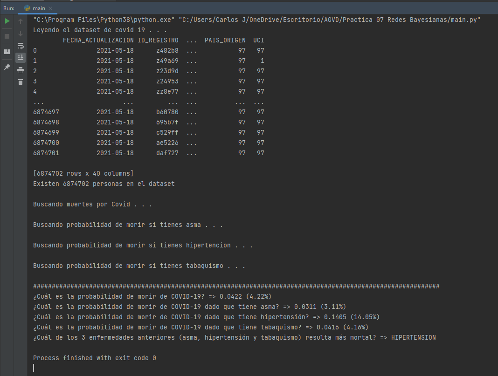

# Práctica 7: Redes Bayesianas
**Objetivo:** Predecir eventos utilizando Redes Bayesianas
**Equipo 5:**
-   Castro Cazares Carlos Jahir (Responsable)
-   Martinez Resendiz Giovanni Hasid
-   Velazquez Aguilar Jaime Isai

# Configuración
***Version***
Python 3.8.8

**Programado y Probado en Windows 10**

***Librerías***
Instalar las siguiente librerías de python:
 - pandas => pip install pandas

***Archivo CSV***
Cambiar la ruta del archivo CSV del dataset en la variable **rutaArchivo (Linea 16)**, por la ruta del archivo completo del dataset, que no puede ser subido por su tamaño de 1GB (Actualmente esta la ruta del archivo grande de la computadora donde se programo).

# Correr Practica
Correr el archivo **main.py**, en la consola con el cambio de la ruta del dataset ya cambiada y la informacion se desplegara en la consola.

# Evidencia del Programa Localmente
